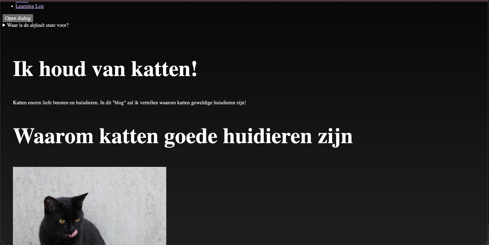
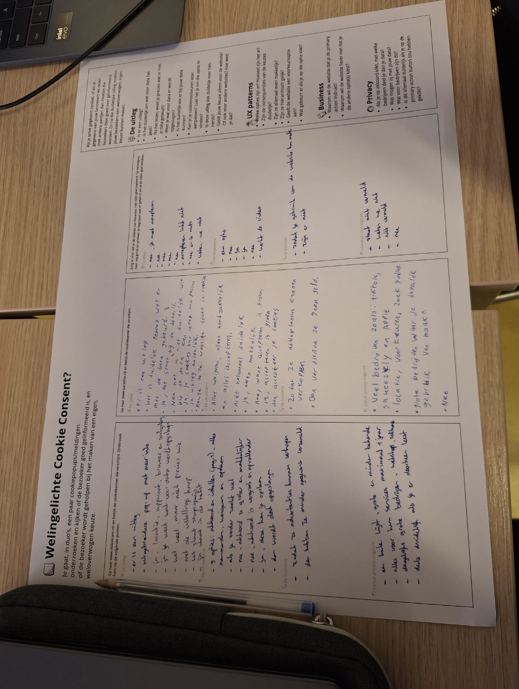
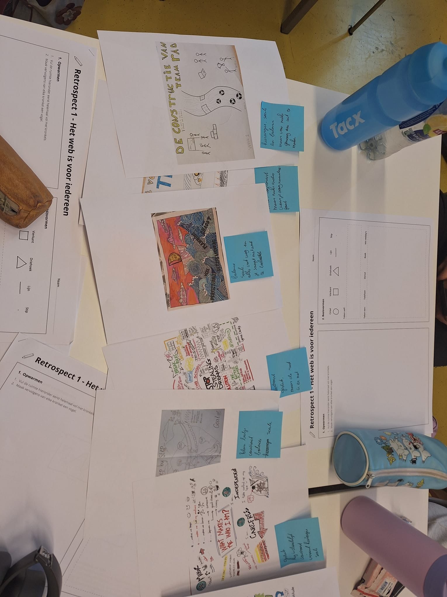
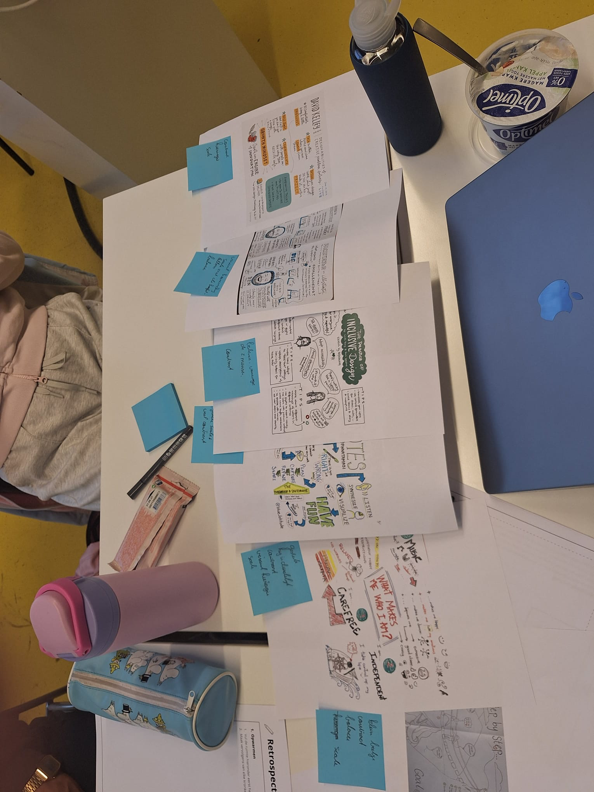
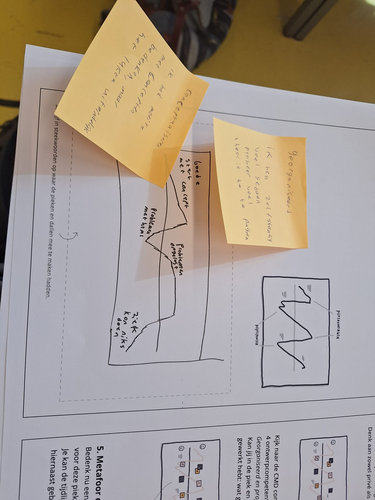
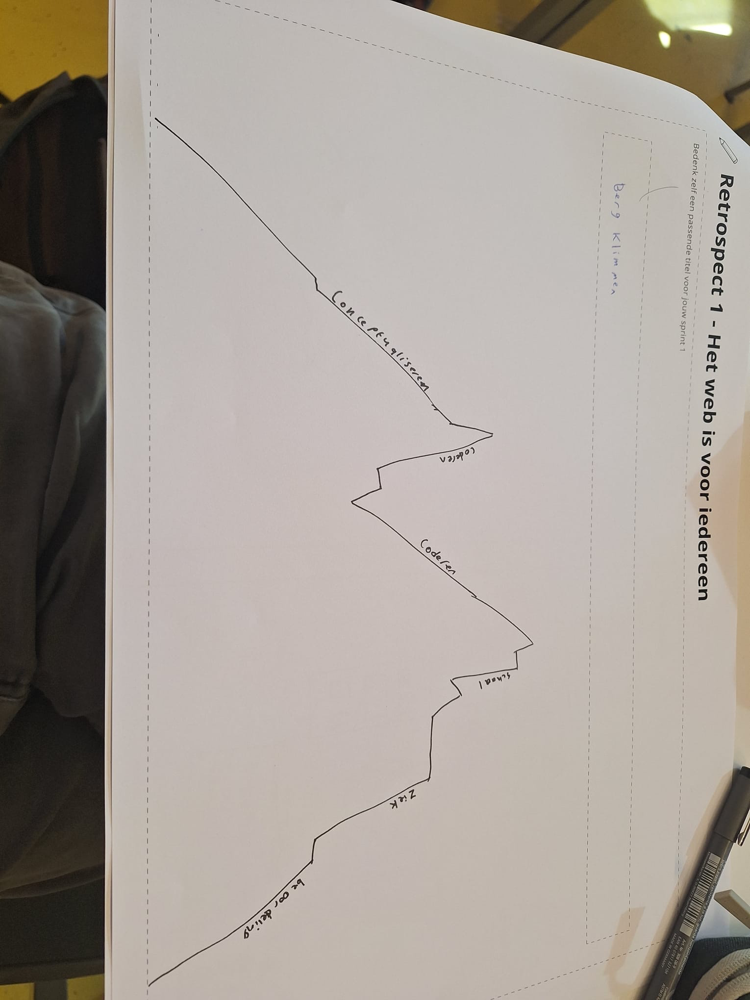
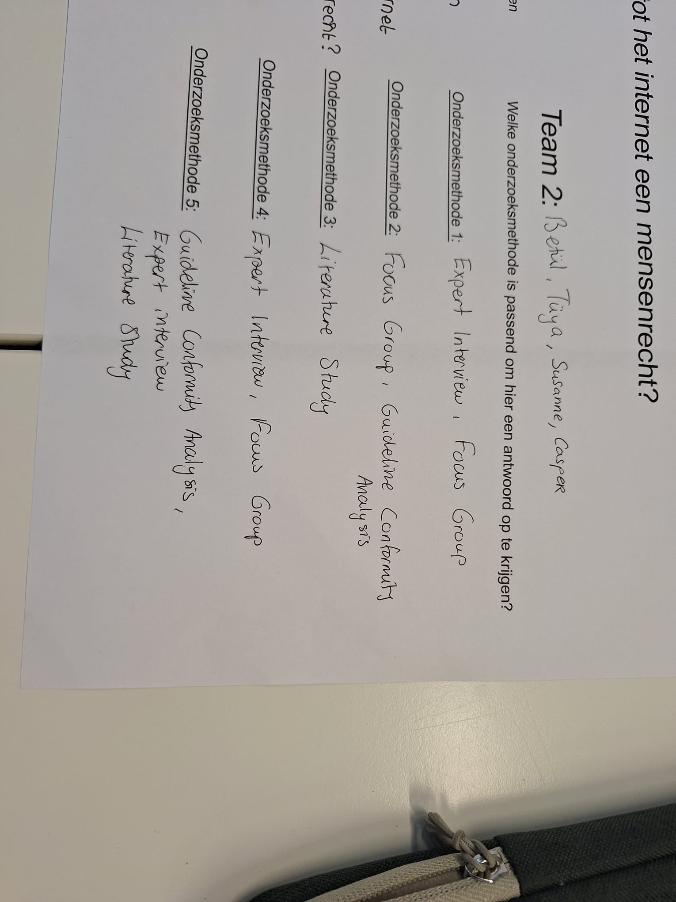
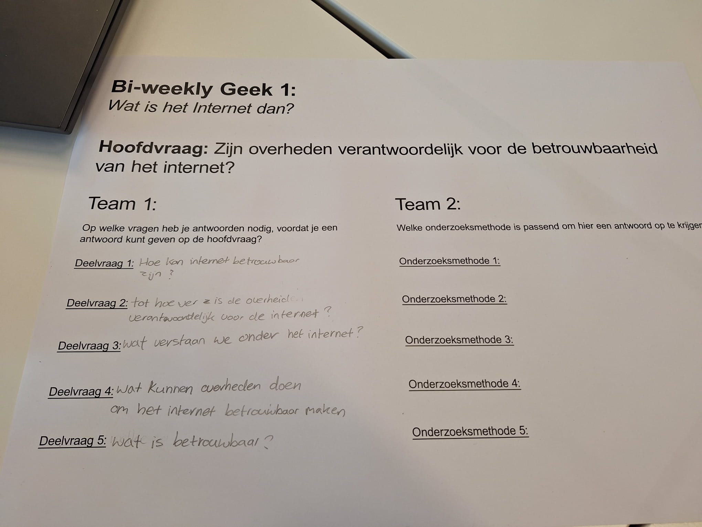
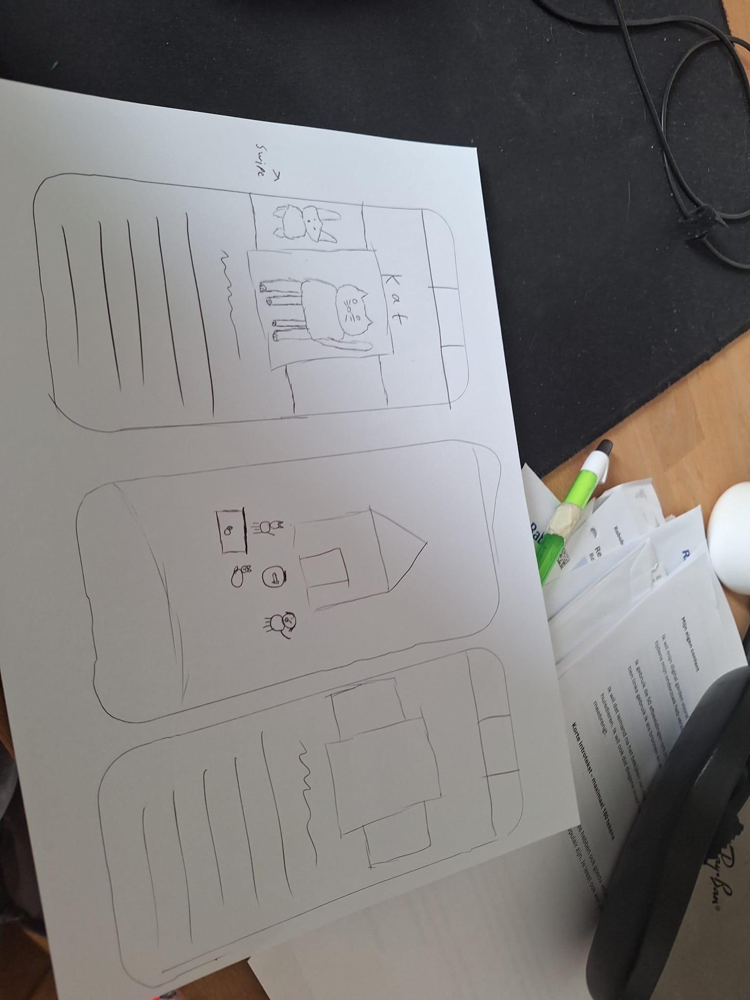
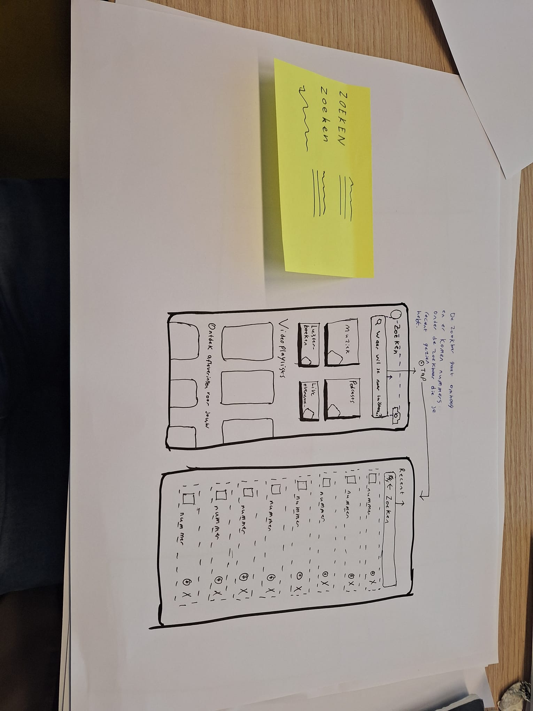

_Kopieer en plak hier jouw README.md uit sprint 1._

### sept 24

Ik heb vandaag de pagina een nieuwe img gegeven met light dark nog niet dezelfde groote werk eraan. Ik heb geprobeerd een modeless dialog te maken, maar dat werkt nog niet.

### sept 23

Ik heb een plan voor de Human Consent Component ik ga ze in een knop of pop up maken

Wat is een wireflow en wat heb je er aan?

Een wireflow is een schets die een process laat zien.

Wat zijn dark UX patterns? Geef drie voorbeelden...

Dark UX paterns zijn patronen die de gebruiker verleiden om iets te doen wat de gebruiker waarschijnlijk niet zou doen.

Price comperison, hidden costs en FOMO

Waar moet je als ontwerper rekening mee houden bij het maken van een human consent component?

Dat het de gebruiker goed informeerd en hun een keuze geeft.

### sept 21

Verse start voor nieuwe web pagina ik ga het kleiner doen en strict aan de opdracht proberen te houden

Wat zijn HTML landmark role elements?
Dan kan je makkelijk in de scrol map vinden waar je lementen heb gezet

Wat zijn heading elementen en hoe horen deze 'genest' te worden?
elementen van andere HTML die je in CSS aanpast in bv de header om die specefiek aan tepassen en niet op de hele pagina.

### 18 sept

Oriënteren en begrijpen

Vragen en termen

1. Waarom geven de docenten deze opdracht?

Docenten geven een opdracht altijd met een reden. Ze willen dat je iets specifieks leert, iets wat je nu nog niet kunt. Je kunt een docent zien als een opdrachtgever. Ook bij een opdrachtgever wil je er achter komen waarom die deze opdracht geeft. Het is altijd een goed idee om te blijven vragen tot je het begrijpt.

- De docenten geven mij deze opdracht om mij te leren hoe ik de basis van een webpagina kan maken.

2. Welke technieken gebruik ik?

Een van de belangrijkste leerdoelen van dit blok is het leren van HTML en CSS zodat je een betere digitale ontwerper wordt. Je kan er vanuit gaan dat HTML en CSS een belangrijke rol spelen in de opdracht.

- Ik gebruik: light-dark, -- properties en grids.

3. Wat zijn de randvoorwaarden?

Naast de gebruikte techniek zijn er eigenlijk altijd ook andere randvoorwaarden. Zorg er voor dat je die goed voor ogen hebt. Bijvoorbeeld: hoe veel tijd heb je? Wat is je kennis tot nu toe? Maar ook: is mijn ontwerp wel toegankelijk? voldoet het aan de privacy-wetgeving? En ook: is mijn ontwerp wel echt webby of maak ik een plaatje van een website?

- Een werkende webby website met toegankelijk features en genoeg content.

4. Waar gebruik je HTML/CSS voor?

Wees je bewust van de mogelijkheden en de onmogelijkheden van HTML en CSS. HTML is om content te structureren en om interactie mogelijk te maken. CSS is om vorm te geven, om dingen te verduidelijken, en om interactie prettiger te maken.

- Je gebruikt HTML voor tekst schrijven en knoppen maken, je gebruikt CSS om stijl aan te passen.

5. Wat kan er allemaal met CSS?

Niemand weet wat er allemaal kan met CSS, er kan zoveel, steeds meer, en nog niet alles is ontdekt. Maar je kan wel een heel goed beeld krijgen van wat er allemaal ongeveer kan. Je kan op allerlei manieren dingen layouten, je kan eindeloze hoeveelheden visuele effecten toepassen, en je kan op talloze manieren dingen laten animeren. Je hoeft natuurlijk niet alles te kunnen, daar is dit blok veel te kort voor, maar het is wel lang genoeg om te zien wat er allemaal kan. Dan kan je kiezen wat je wil gaan leren, zowel tijdens het blok als daarna.

Verbeelden en conceptualiseren

Vragen en termen

1. Lukt het om verschillende ideeën te bedenken?

Het is meestal een goed idee om eens een paar verschillende mogelijke oplossingsrichtingen te onderzoeken. Dat kunnen bijvoorbeeld een paar schetsjes zijn. Maar er zijn natuurlijk ook een heleboel andere mogelijke creatieve onderzoeksmethoden.

- Ja, maar ik hebt moeite om soms van een idee af te zetten.

2. Lukt het om je ideeën te schetsen?

Door je ideeën te schetsen krijg je nieuwe inzichten. Als je het voor je ziet zie je dingen die je in je hoofd niet ziet. Door er fysiek aan te werken kom je ook details tegen die je in je hoofd wellicht over het hoofd ziet. En door het te schetsen kan je het delen. Je kan medestudenten, of docenten, vragen wat zij er van vinden en dan krijg je ook hun ideeën er gratis bij!

- Ja, door crazy-8 lukt het om ideeen te kunnen schetsen.

3. Wat doet deze CSS-property?

Spelen met materiaal is ook een manier om op nieuwe ideeën te komen. Een geweldig variable font kan je ineens een heel nieuw idee geven. Spelen met CSS-gradients kan je een onverwachte vormgevingsrichting opsturen. Spelen met CSS animaties en transities kan je nieuwe ideeën geven over hoe de interactie moet werken. Etc.

- ??

4. Welke content, en welke HTML heb ik nodig?

Een andere goede manier om op nieuwe ideeën te komen is door eens goed naar de inhoud te kijken: wat moet er ongeveer op deze pagina komen? Alleen tekst? Afbeeldingen? Wat voor interactie? Is een header met een navigatie echt nodig? Is het een lijstje met dingen? Of is het eigenlijk één lang artikel?

- ???

5. Hoe kan ik dit soort content vormgeven?

Kale HTML is lelijk. Met CSS kan je het mooi maken. En dat kan op alle mogelijke manieren. Je kan dingen onder elkaar zetten, naast elkaar of achter elkaar. Je kan dingen in een keurig grid zetten of in een chaotische flexbox-layout. Je kan hysterische kleuren gebruiken of een ingetogen minimalistische stijl kiezen. Je moet nadenken over verschillende manieren hoe jouw gebruikers jouw website willen bedienen.

- ????

6. Wat als ik hier nu eens 1000 invul?

We zijn eigenijk best vaak voorzichtig. Onze ontwerpen zijn dus ook vaak nogal subtiel. Dan denken we een zeer expressief ding gemaakt te hebben, maar het valt niemand echt op. Probeer dus ook eens 1000 in te vullen, in plaats van 1.1. Dingen worden dan niet alleen enorm onsubtiel, maar er gebeuren ook dingen die je niet van tevoren kunt bedenken. Ook dat hoort natuurlijk bij verbeelden en conceptualiseren.

- ????????

Prototypen en uitwerken

Vragen en termen

1. Begrijpen bezoekers de site?

De enige echte manier om er achter te komen of bezoekers jouw site wel begrijpen is door een werkend prototype te maken. Door dit prototype met HTML en CSS te maken kan je op een heel ander detailniveau testen.

- Nee, want de site is nog niet af. de gebruiker weet niet waar de site over gaat.

2. Wat vindt de opdrachtgever er van?

Jouw bedoelingen worden veel duidelijker met een werkend prototype. Dat kan om een klein werkend detail gaan, of om een gehele pagina.

- De opdrachtgever vondt de site niet af, wat logisch is. De content die er was was ook niet goed genoeg.

3. Werkt dit wel?

Vaak verzinnen we dingen die niet kunnen, of die heel moeilijk te maken zijn. Daar kom je vaak pas achter als je gaat bouwen. Wacht dus vooral niet te lang, je wil er niet in de laatste week achter komen dat iets niet kan.

- Mijn idee werkte niet. Het was veel te veel voor 2 weken. Im moet meer focusen.

4. Oooooh, kan dit óók?!

Tijdens het maken kom je vaak ook op hele nieuwe ideeën. Door een CSS techniek te gebruiken kom je er achter hoe die werkt, en kom je er achter dat je er nog veel meer mee kunt doen. Je leert dit soort technieken veel beter door ze echt toe te passen, dan zit het meteen in je vingers.

- Is dit een vraag?

Evalueren

1. Reflecteren met the riddle:

Een goede manier om bewuster te reflecteren is door je telkens deze vier vragen te stellen: (1) wat wilde ik weten? (2) wat deed ik om er achter te komen? (3) wat was het resultaat? (4) wat weet ik nu (niet)?

- 1. Ik wilde weten of ik een website kon maken.
  2. Ik probeerde om een website te bouwen en nieuwe technieken te gebruiken
  3. Het resultaat was dat ik een te ambitieus project ondernam.
  4. Ik weet dat ik een gefocust website moet maken met de tijd die ik heb 2 weken (ik dacht dat we 6 weken kregen).

2. Wat wil(de) ik weten/bereiken?

Deze vraag kan je je na elke activiteit even stellen. Waarom ging ik dit ook al weer doen? Wat wilde ik bereiken? Of wat ging ik ook al weer onderzoeken? En waarom wilde ik dit ook al weer weten?

- Ik wou een leuke website maken, met een intressante feature.

3. Wat heb ik gedaan?

Tijdens je creatieve proces, of tijdens je creatieve onderzoek doe je dingen. Je doet dingen als code typen, schetsen maken, bronnen bestuderen, etc. Het is goed om achteraf altijd even bewust terug te kijken naar wat je allemaal gedaan hebt. Je kan je dan afvragen wat goed werkte, en wat minder goed, en dan kijken of je daar goede redenen voor kunt verzinnen.

- Ik heb een site met 5 knoppen gemaakt met een achtergrond die matcht.

4. Wat was het resultaat?

Nadat je iets hebt gedaan heb je resultaat. Sommig resultaat is heel tastbaar: je hebt een aantal schetsen, je hebt een stuk code geschreven, je hebt oefeningen gedaan, je hebt een prototype getest etc. Maar ook heb je dingen die minder tastbaar zijn, maar ook heel belangrijk: je hebt bijvoorbeeld nieuwe, verschillende inzichten na een schetsoefening. Je hebt kennis vergaard over een bepaalde CSS-techniek. Je hebt bewijs dat een bepaald ontwerpdetail (niet) goed werkt. Door je bevindingen expliciet te benoemen word je je hier bewuster van, en kan je van de verschillende oefeningen beter op waarde schatten.

- Het duurde te lang om te maken en de plaatjes bewegen en het adaptief maken duurde te lang.

5. Wat weet je nu (niet)?

Nadat je iets hebt gedaan weet je dingen. Maar je bent je ook bewuster van wat je nog niet weet. Je weet bijvoorbeeld hoe je een responsive menu maakt met flexbox, maar je weet ook dat je flexbox nog niet helemaal begrijpt. Of je weet dat uit een user-test bleek dat een bepaald concept onduidelijk is, maar je weet nog niet hoe je dit wel duidelijk moet maken. Dus: wees je bewust van wat je hebt geleerd, en van wat je nog wil leren.

- Ik weet nog niet hoe je goed kan bug checken en hoe je iets effiecent kan maken met code.

6. Wat vond je (niet) leuk?

Door dingen te doen kom je er achter of je iets wel of niet leuk vindt. Je kan bijvoorbeeld denken dat je code schrijven niet leuk vindt, maar het komt best vaak voor dat je er ineens achter komt dat je CSS echt een hele leuke vormgevingstaal vindt. Daar kom je alleen achter door het te doen. Het is prettig voor jezelf om te weten wat je wel en niet graag doet. Maar dat weet je pas echt als je het vaak genoeg geprobeerd hebt.

- De-bugging

7. Voldoet het nog aan de eisen?

Elke opdracht heeft bepaalde voorwaarden en beperkingen. Soms wijk je daar, zonder dat je het door hebt, tijdens het werken van af. Stel je dus regelmatig de vraag of datgene wat je aan het doen bent wel datgene is wat er moet gebeuren. Hoe eerder je er achter komt dat dat niet zo is, hoe minder vervelend het is. Een uurtje afdwalen is veel minder erg (en vaak zelfs onverwacht goed) dan een hele week weggooien. Bekijk nog eens de randvoorwaarden bij deze sprint en verhoud je daar toe.
Er zijn een aantal regels waar jouw site de komende sprints steeds meer aan gaat voldoen, wellicht kan je hier nu al op reflecteren.

- Mijn opdracht voeldoet niet aan de eisen, omdat ik dacht dat ik nog meer tijd had.

8. HTML validatie

Is de HTML die je hebt geschreven nog wel valide? Check het regelmatig, hiermee voorkom je onverklaarbare fouten. En klopt de HTML wel? Gebruik je de juiste elementen op de juiste plek?

- Ik denk het wel?

9. Toegankelijkheids-check

Check regelmatig of je website nog wel goed te gebruiken is met het toetsenbord. En of hij nog te begrijpen is met een screenreader. Zitten er alt-teksten op de afbeeldingen? Is het contrast overal hoog genoeg?

- Het is toegankelijk.

10. Is mijn website nog wel adaptief?

Werkt mijn website nog met light en darkmode? Wat gebeurt er met de prefers-reduced-motion instelling? Werkt het op verschillende schermgroottes?

- De website groote is nog niet goed, maar het heeft een soort darkmode.

11. Voldoet mijn website nog wel aan de wet?

Overtreed je de wet niet? Bijvoorbeeld door afbeeldingen van iemand anders te gebruiken, door je niet aan de AVG te houden, of door iets ontoegankelijk te maken?

- Nee.

12. Zie ik mezelf nog wel terug in wat ik doe?

Kijk regelmatig kritisch naar wat je aan het doen bent en vraag je dan af of dit wel is wat je wil maken, en wat je wil leren.

- Ik weet het niet mijn visie was niet compleet, de basis was er ook nog niet.

Retrospective formulier

### 14 sept

Ik heb een link aangeleged en heb progressie gemaakt bij de start pagina.

Leg uit wanneer een website 'lelijk' wordt
Wanneer het moeilijk is om naar te kijken.

Vertel welke volgende stap je neemt om je website responsive te maken.
Ik maak de grid minder kolomen

Heb je een plan om de volgende stap voor vrijdag te maken?
Ik ga proberen om de start pagina af te hebben en de teskt van de hond af te hebben.

### 12 sept

Ik heb de artikelen gelezen. Wat ik ervan begrijp is: Het internet is erg fragiel en 3 bedrijven hebben een monopolie op data. Er is een beweging van Berners-lee om alle systeem meer compatebiel te maken en dat het meer trasparant wordt.

### 11 sept

Mijn concept van digital garden is goed gekeurd de docenten en ze zijn blij over mijn voortgang.

Reminder dark mode doeer achtergrond van huis naar nacht te maken.

Ik heb de darkmode tot praat gekregen en meer knoppen ingevoegd.

### 10 sept

Ik heb 5 schetsen gemaakt. Een deepdive gedaan over gradients en ik heb code geschreven voor mijn garden.

### 9 sept

Vragenlijst voor Jesse

Eigen verbinding:​

Wat is voor jou de essentie van wat je hebt gepresenteerd qua onderwerp en geschreven/beeldende content? ​

Een webby websites met veel verschillende films van alle gengres erin.

Welke woorden uit de kwaliteitenlijst kunnen passen bij je onderwerp?​

Initief rijk, doelgericht

Heeft 'de ander' een aanvulling op je onderwerp?​

Probeer het niet te groot te maken.

Wat is het karakter/ de uitstraling/ het gevoel dat bij het onderwerp past? (bijv. stoer, hip, vrolijk, dynamisch, eenvoudig, enz.)​

Complex

Welke inspiratie kun je uit je 25 afbeeldingen halen. Stijl, een gevoel, vorm, enz.

Erg gemixten stijlen en dat is het goal.

Verder heb ik nog de lessen afgemaakt

### Casper vragenlijst

Vragenlijst voor Casper.

Eigen verbinding:​

Wat is voor jou de essentie van wat je hebt gepresenteerd qua onderwerp en geschreven/beeldende content?

​Ik dat mensen leren leren hoe ze goed dieren kunnen verzorgen.

Welke woorden uit de kwaliteitenlijst kunnen passen bij je onderwerp?​

Diervriendelijk.

Heeft 'de ander' een aanvulling op je onderwerp?​

Tips voor animatie

Wat is het karakter/ de uitstraling/ het gevoel dat bij het onderwerp past? (bijv. stoer, hip, vrolijk, dynamisch, eenvoudig, enz.)​

Vrolijk

Welke inspiratie kun je uit je 25 afbeeldingen halen. Stijl, een gevoel, vorm, enz.​

Veel dierensoorten. Alle dieren lijken niet op elkaar.​

Een stip op de horizon​

Wat zou je willen vertellen over het onderwerp aan een ander?

Het is dat je een dier goed verzorgd daarom wil

en hoe zou je dat voor je kunnen zien? middels welke beeld, tekst, animatie, inhoudelijke content? (bijv. Ik wil voornamelijk afbeeldingen tonen, als een soort Pinterest, of ik wil muziek fragmenten laten horen, of ik gebruik korte teksten met eigen foto's). ​

Vul deze zin aan:
Ik wil mijn Digital Garden laten gaan over dieren verzorgen.
en wil dat laten zien door …………………………….. aan content te tonen.
Ik begin met een stukje eigen content over …………………….… . ​
Als het begin is gemaakt kan ik mijn Garden verder uitbreiden door ….....................​

### 8 sept

Vandaag ben ik bij de deepdive van vasillis geweest en ik weet nu hoe je unieke elementen kan aanmaken en light en dark mode kan maken ik heb nog moeitemet de afbeelding ander maken.

### Idee digital garden

PetJam!
Ik hou van huisdieren dus mischien verzammeling over mischien geschiedenis van de soort huisdieren en waarom ze mensen helpen. Ook de reden dat mensen ze lief vinden? Ander video games ik vindt video games geweldig tijd verdrijf, maar het beperkt creativiteit? rambeling.

### 7 sept - workshop

De autheur wil je overhalen op zijn definitie van digital gardening.

De tekst gaat over de geschiedenis van digital gardening: Het was eerst een website met een verzameling van informatie, daarna wedt het opschonen van een website, het werdt hierna populairder en gingen meer mensen gardens maken. Digital garden zijn sites waar informatie op ene chaotische format staan, die je zelf heb gemaakt.

Websites analyseren:

Sixey.es meest expresief die ik heb bezocht, Vit baisa erg saai alleen teskt en niks meer ook geen kleur.

Beste site b00k.net erg toegankelijk.
Slechste site Vit baisa niet mooi

- Leg uit wat een digital garden is en waarom dat anders is dan een reguliere website.
  Een digital garden is iemands eigen website die chaotisch kan zoijn waar ze alle informatie die ze willen kunnen opzetten.

- Leg uit wat een website 'webby' maakt en welke websites jou het meeste inspireren.
  Een website is 'webby' als het adeptief, interactief, toegankelijk, volwassen en expresief is.

- Vertel waar jij mee aan de slag wilt gaan bij het maken van jouw eigen digital garden let op: dit zijn jouw eerste ideeën, dit kan en mag veranderen in de loop van het programma.

PetJam!
Ik hou van huisdieren dus mischien verzammeling over mischien geschiedenis van de soort huisdieren en waarom ze mensen helpen. Ook de reden dat mensen ze lief vinden? Ander video games ik vindt video games geweldig tijd verdrijf, maar het beperkt creativiteit? rambeling.

Verdere idee over hoe ik een garden kan maken is Wierd pets waar ik huisdieren vindt die je niet vaak tegen komt en hoe je het verzorgt?

### 5 sept - deepdives

Ik heb vandaag geleerd hoe je beter kan schetsen en heb nieuwe features van CSS gevonden waaronder unieke classes.

### 3 sept - [Workshop]

Ik heb mijn bassis met HTML en CSS ververst en micro interacties ververst ik heb daarbij een nieuwe design vor wok to walk gemaakt.

### 31 aug - Kickoff

Een fork van de model repository gemaakt en gepubliceerd via mijn eigen Github omgeving.

1. Leg uit wat een source hosting platform is en voor welke jij gekozen hebt.
   Een source hosting platform is een platform dat iets online kan zetten zodat meerder mensen erbij kunnen de code van een platform zit daarin. Ik heb codeberg gekozen, omdat github niet werkte.
2. Vertel welke domeinnaam jij gekozen hebt en hoe je die hebt gekoppeld aan jouw pagina.
   Digi-Journey, omdat coderen van een website nieuw voor mij is. Ik heb het nog niet kunnen koppelen.

3. Beschrijf hoe je aanpassingen aan jouw pagina kunt maken en hoe je er voor zorgt dat die op het web gepubliceerd worden.
   Ik heb nog geen aanpassingen kunnen doen, want ik heb de website nog niet klaar.
   Als je de code opslaat zal het bedrijf waarvan je het domein heb gekocht het aan;passen in een tijdje.
